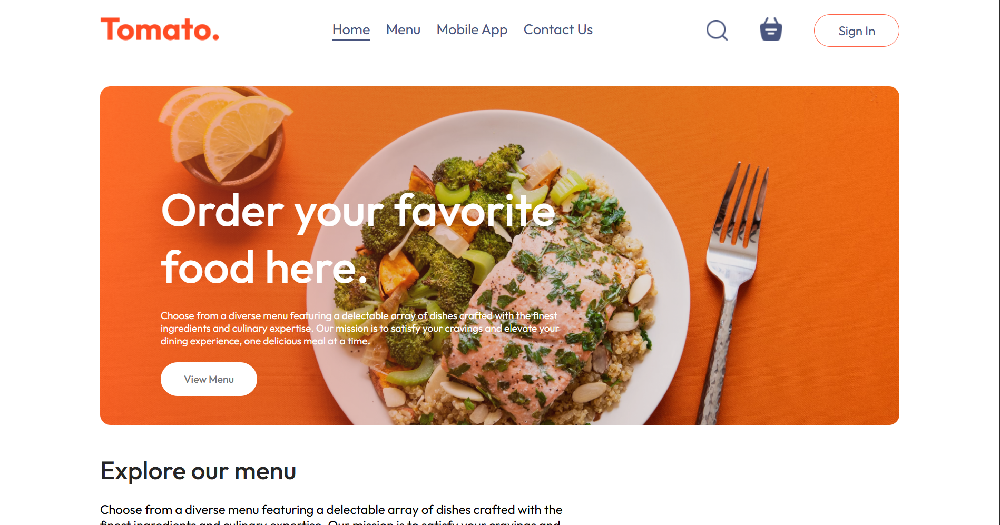

# Tomato Food Ordering App



A modern React app to order your favorite food online. Choose from a diverse menu, manage your cart, and place orders effortlessly.<br>Live Preview: [Live](https://foood-delivery.vercel.app/)<br> YouTube Tutorial: [GreatStack](https://www.youtube.com/watch?v=9jRTo7ILxQc)

---

## Features

- Browse top dishes near you
- Add and remove items from cart
- View cart subtotal, delivery fee, and total
- Promo code input (UI only)
- Responsive navigation bar with active menu highlight
- Login popup modal
- Smooth client-side routing with React Router
- Clean and accessible UI components

---

## Technologies Used

- React (with hooks & context API)
- React Router DOM
- Vercel for deployment
- CSS modules & custom styling
- JavaScript (ES6+)

---

## Getting Started

### Prerequisites

- Node.js (v14 or higher recommended)
- npm or yarn package manager

### Installation

1. Clone the repository:

   ```bash
   git clone https://github.com/milancodess/foodDelivery.git
   cd foodDelivery
   ```

2. Install dependencies:

   ```bash
   npm install
   # or
   yarn install
   ```

3. Start the development server:

   ```bash
   npm start
   # or
   yarn start
   ```

4. Open your browser and visit `http://localhost:3000`

---

## Deployment

This app can be easily deployed on [Vercel](https://vercel.com):

- Push your code to GitHub/GitLab/Bitbucket
- Import your repo on Vercel
- Vercel auto-detects React and builds your app
- For React Router support, add a `vercel.json` with rewrites:

  ```json
  {
    "rewrites": [{ "source": "/(.*)", "destination": "/index.html" }]
  }
  ```

---

## Folder Structure

```
foodDelivery/
├── public/                  # Static files (including header_img.png)
├── src/
│   ├── assets/              # Images and icons
│   ├── components/          # Reusable React components (Navbar, Footer, Header, Cart, etc.)
│   ├── context/             # React Context API files (StoreContext)
│   ├── pages/               # Route components (Home, Cart, PlaceOrder)
│   ├── App.jsx              # Main app component
│   ├── index.js             # React entry point
│   └── styles/              # CSS files
├── .gitignore
├── package.json
└── README.md
```

---

## Future Improvements

- Implement backend API for order management
- User authentication and profile management
- Promo code validation and discounts
- Payment gateway integration
- Enhanced UI animations and accessibility improvements

---
